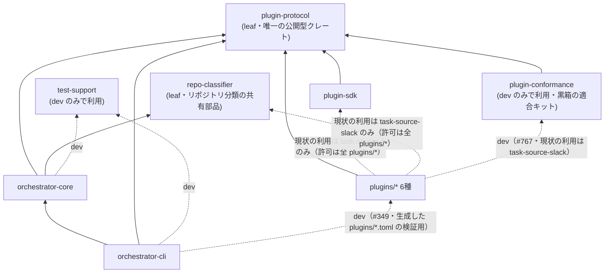

# ワークスペース依存境界ルール（Fitness Function）

totsuka はヘキサゴナル構成を採用しており、ワークスペース内クレート間の依存は以下の形に保つ。この不変条件は規約だけでなく、`scripts/arch-lint.sh` が CI で機械検証する（[ADR-0011](/decisions/adr-0011-arch-fitness-function.md)、[#172](https://github.com/tomoya-k31/totsuka/issues/172)）。

## 依存グラフ（あるべき形）

`cli -. dev .-> plugins` は**このグラフで唯一「上位が下位ではなく横を向く」エッジ**なので、意図を書き残しておく。`totsuka setup` が生成する設定テーブルを、プラグイン自身のデシリアライザ（`GithubConfig` / `SlackConfig`）が受理することをテストで固定するためだけに存在する（[#349](https://github.com/tomoya-k31/totsuka/issues/349)）。「TOML としてパースできる」までしか見ないと、キー名を 1 つ間違えても実行時まで露見しない。

**実行時のリンクは無い**（`[dev-dependencies]` なので `totsuka` バイナリには入らない）。プラグインはプロセス境界の向こうで動く（[ADR-0011](/decisions/adr-0011-arch-fitness-function.md) が守っている前提）という点は変わらず、`plugins/*` 側の許可リストにも影響しない — 向きが逆なので `plugin-deps` / `plugin-dev` の検査対象外である。

## 不変条件（検証ルール）

対象は**ワークスペース内クレート間**の依存のみ（crates.io 等の外部依存は対象外）。

| 対象 | `[dependencies]` | `[dev-dependencies]` | `[build-dependencies]` |
|---|---|---|---|
| `plugins/*` | `plugin-protocol` / `plugin-sdk` / `repo-classifier` のみ | 左記 + `test-support` / `plugin-conformance` | なし |
| `plugin-sdk` | `plugin-protocol` のみ | `plugin-protocol` / `test-support` | なし |
| `plugin-conformance` | `plugin-protocol` のみ | なし | なし |
| `plugin-protocol` | なし（leaf） | なし | なし |
| `repo-classifier` | なし（leaf） | なし | なし |
| 全クレート | 依存循環なし（normal + build + dev の全エッジで検査） | | |

- `orchestrator-core` / `orchestrator-cli` / `test-support` に個別の許可リストはない（循環検査のみ対象）。**したがって `cli → plugins`（dev）のようなエッジは arch-lint では検出できず、本ドキュメントのグラフが唯一の記録になる** — 追加したら必ずここに書く。
- `plugins/*` の判定はクレート名の列挙ではなく **manifest パス（`plugins/` 配下）** で行うため、新プラグインを追加してもスクリプトの更新は不要。
- dev-dependencies だけの循環は cargo 的には合法だが、本ワークスペースでは意図しない結合とみなしエラーにする。
- **`plugin-conformance` が `plugin-protocol` 以外に依存しないこと**（`conformance-deps`、#767、[ADR-0104](/decisions/adr-0104-plugin-conformance-kit.md)）。これはプラグインのバイナリを stdio の外から検査するキットで、検査対象の中核は `plugin-sdk` のランタイムと dispatch である。キットが SDK の型や関数を使い始めると、SDK の誤りをキットが同じ誤りで打ち消し、緑のまま通ってしまいうる。外部開発者が git の dev-dependency で入れたときに不要な依存を引き込まないためでもある
- **`repo-classifier` が leaf であること**（`classifier-leaf`）は、core と plugins の**両方**が依存する共有部品だから要る（#723、[ADR-0083](/decisions/adr-0083-repo-classifier-crate.md)）。これがワークスペース内の何か（たとえば `plugin-protocol`）に依存し始めると、プラグインから core 側の関心事へ届く抜け道になる。`plugin-protocol` が「プラグイン境界の公開型」なのに対し、こちらは「外部の分類 API をどう叩くか」で、プロトコルの一部ではない。

### プラグイン成果物の命名

依存境界とは別軸だが、同じスクリプトが検査するもう 1 つの不変条件。

| 対象 | 不変条件 |
|---|---|
| `plugins/*` | bin ターゲットをちょうど 1 つ持ち、その名前が同ディレクトリの `plugin.toml` の `name` と一致する |

`totsuka plugin install` は「`plugin.toml` の `name` と同名のバイナリ」を要求し、ストアも `<plugin dir>/<name>` として配置する。ここが食い違っていると導入のたびに手作業のリネームと dist ディレクトリ組み立てが要る（実際に長らくそうなっていた: `task-source-slack` vs `slack`）。揃えておくと `target/{profile}/<name>` がそのまま install 可能・配布可能になる（[ADR-0027](/decisions/adr-0027-plugin-artifact-naming.md)）。

### orchestrator-core 内部の層（`core-layer`）

クレート**内**の向きも 1 つだけ機械検査する（#762、[ADR-0102](/decisions/adr-0102-core-internal-layering.md)）。上の検査は `cargo metadata` に現れるクレート間の依存しか見ないので、これはソースをテキストとして読む。

| 対象 | 参照してはいけないもの |
|---|---|
| `orchestrator-core/src/domain/**` | `config`（設定ファイルのスキーマ）・`adapters`（具体的な実装） |
| `orchestrator-core/src/ports/**` | 同上 |

- **数えないもの**: コメント（ports の doc は実装へのリンクを持つが、rustdoc のリンクは依存ではない）と、各ファイルの `#[cfg(test)]` 以降（domain のテストは TOML から `Workflow` を組み立てるために config を使う）。
- 各行のパス（`crate::config` とパスの途中の `config::` / `adapters::`）に加えて、`use` 文を `;` まで 1 つにまとめて読み、区切りに `config` / `adapters` という名前が現れたら違反にする。`use super::super::config::X` も、`use crate::{config};` や複数行のグループに `as` で別名を付けた形も捕まる。外部クレートの `…::config` を use すると誤検知になるが、今の domain / ports にその形は無い。
- 対象ファイルが 0 件なら検査の失敗（exit 2）にする。ディレクトリを動かしたときに黙って素通りしないため。
- **3 層の外のモジュール**（`run`・`scheduler`・`recovery`・`worktree`・`plugins` などのアプリケーション層、`platform`・`logging`・`paths` などの基盤）は検査しない。アプリケーション層が adapters を組み立てて使うのは正当な向きである（`recovery` → state DB、`plugins::spec` → `PluginSpec`）。

## ガードの仕組み

- **スクリプト**: `scripts/arch-lint.sh`。`cargo metadata --no-deps`（依存解決なし・ネットワーク不要・数秒）の出力を jq で抽出し、許可リスト照合・Kahn 法による循環検査・プラグイン成果物の命名検査を行う。core 内部の層（`core-layer`）だけは awk でソースを読む。違反 1 件以上で exit 1。
- **CI**: `ci.yml` の `clippy / rustfmt` ジョブ内の step `Check architecture invariants` として毎 PR 実行（ジョブは増やさない — [ADR-0007](/decisions/adr-0007-ci-cost-optimization.md) の「既存ジョブへのステップ追加を優先」に従う）。
- **ローカル**: pre-PR チェックの Rust set（`.claude/rules/dev-flow.md`）に含まれる。

## 正当な依存追加時の更新手順

アーキテクチャ上正当な理由でワークスペース内依存を追加・変更する場合は、同一 PR で:

1. `scripts/arch-lint.sh` 冒頭の許可リスト変数（`PLUGIN_ALLOWED_*` / `SDK_ALLOWED_*`）を更新する
2. 本ドキュメントの不変条件表と依存グラフを更新する
3. 判断がアーキテクチャ変更に相当するなら ADR を作成する（[/decisions/](/decisions/index.md)）
