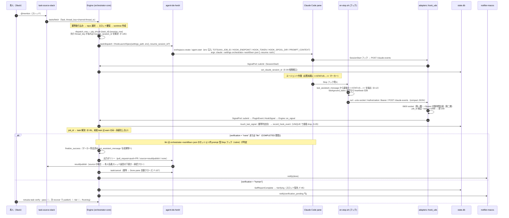
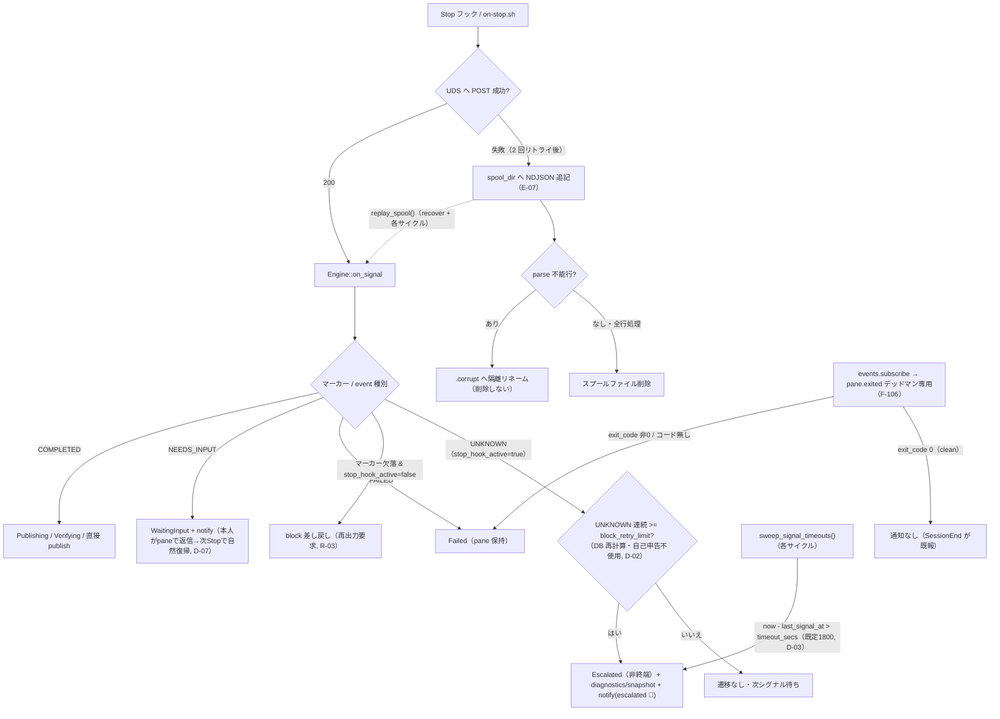
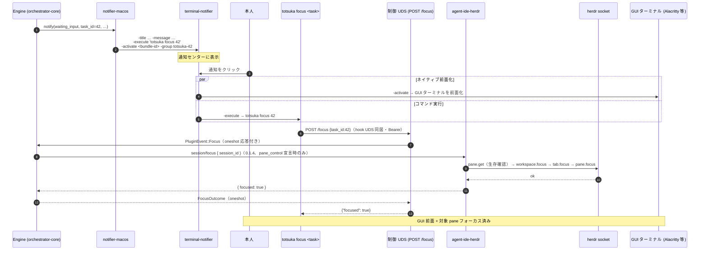

# 概要

Claude Code の完了検知を screen-manifest からフック機構へ移した後の、タスク 1 本のエンドツーエンド経路。要件は [F-100〜F-107](/product/orchestrator-spec.ja.md)、配置の意思決定は [ADR-0004](/decisions/adr-0004-hook-completion-signal.md)、受信契約は [POST /claude-events](/apis/claude-events.md)。登場コンポーネントは [task-source-slack](/components/task-source-slack.md) / [orchestrator-core](/components/orchestrator-core.md) / [agent-ide-herdr](/components/agent-ide-herdr.md) / [notifier-macos](/components/notifier-macos.md)。

正常系（Slack メンション → 完了 → 検収 → 出力）を主線とし、スプールフォールバックと `pane.exited` デッドマンを分岐で示す。

# 正常系シーケンス

# 異常系・フォールバック

# 通知クリック → pane フォーカス（click-to-focus、F-94）

中間イベント（`waiting_input` / `escalated` / `verification_pending` / `failed`）の通知に気づいた本人が**クリックひとつで対象タスクの pane へ着地する**経路（#155、[ADR-0005](/decisions/adr-0005-click-to-focus.md)）。GUI 前面化（terminal-notifier ネイティブ）と herdr 内フォーカス（`session/focus` 委譲）の 2 段で実現する。

縮退（すべて静か・クリック経路を壊さない）: terminal-notifier 未導入 → notifier が osascript へフォールバック（クリック不可だが通知は出る）。Orchestrator 停止中のクリック → `-activate` の前面化のみ成立し `totsuka focus` は exit 0 の no-op。pane 消失・`pane_control` 非宣言 → `focused: false` + 理由の正常応答。

# 要点

- **受信はコア側**（`ports::SignalPort` + `adapters::hook_uds`）。プラグインは env 注入と `--settings`/`--resume` 起動だけを不透明に配線する（[ADR-0004](/decisions/adr-0004-hook-completion-signal.md)）。
- **冪等の正本は DB**（`hook_events` UNIQUE, D-05）。多重発火・スプール再送・curl リトライは同一冪等キーで無害化される。
- **生存アンカー**（`touch_last_signal`）は冪等判定より前に更新する。中間 Stop=heartbeat が同一冪等キーに潰れても、`sweep_signal_timeouts` の誤エスカレーションを防ぐ。
- **中間イベント**（WaitingInput / Escalated / VerificationPending / Failed）は notifier のみへ配送し、ソーススレッドへは返さない（R-08/D-07）。
- 会話継続（F-105）は `thread_key` 相関で先行セッションを `claude --resume` するが、シグナルは常に自タスクの `job_id` 起点で配路し、共有セッション id から宛先を推測しない（E-09）。

# 関連

- [F-100〜F-107 決定的な完了シグナル / F-94 click-to-focus](/product/orchestrator-spec.ja.md)
- [ADR-0004 フック完了シグナルの受信配置](/decisions/adr-0004-hook-completion-signal.md) / [ADR-0005 click-to-focus の機構選定](/decisions/adr-0005-click-to-focus.md)
- [POST /claude-events（UDS フック受信・POST /focus 制御）](/apis/claude-events.md)
- [click-to-focus セットアップ](/operations/click-to-focus-setup.md)
- [orchestrator-core](/components/orchestrator-core.md) / [agent-ide-herdr](/components/agent-ide-herdr.md) / [task-source-slack](/components/task-source-slack.md) / [notifier-macos](/components/notifier-macos.md)
- [フックのセキュリティ](/security/hook-security.md) / [フックのトラブルシューティング](/operations/hook-troubleshooting.md)
