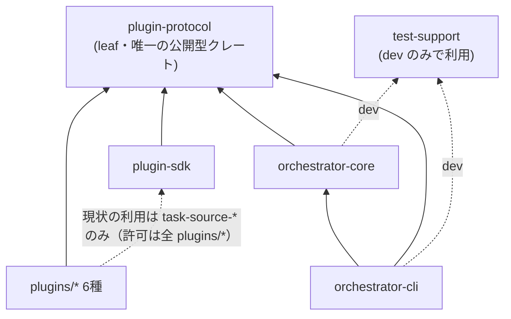

# ワークスペース依存境界ルール（Fitness Function）

totsuka はヘキサゴナル構成を採用しており、ワークスペース内クレート間の依存は以下の形に保つ。この不変条件は規約だけでなく、`scripts/arch-lint.sh` が CI で機械検証する（[ADR-0011](/decisions/adr-0011-arch-fitness-function.md)、[#172](https://github.com/tomoya-k31/totsuka/issues/172)）。

## 依存グラフ（あるべき形）

## 不変条件（検証ルール）

対象は**ワークスペース内クレート間**の依存のみ（crates.io 等の外部依存は対象外）。

| 対象 | `[dependencies]` | `[dev-dependencies]` | `[build-dependencies]` |
|---|---|---|---|
| `plugins/*` | `plugin-protocol` / `plugin-sdk` のみ | 左記 + `test-support` | なし |
| `plugin-sdk` | `plugin-protocol` のみ | `plugin-protocol` / `test-support` | なし |
| `plugin-protocol` | なし（leaf） | なし | なし |
| 全クレート | 依存循環なし（normal + build + dev の全エッジで検査） | | |

- `orchestrator-core` / `orchestrator-cli` / `test-support` に個別の許可リストはない（循環検査のみ対象）。
- `plugins/*` の判定はクレート名の列挙ではなく **manifest パス（`plugins/` 配下）** で行うため、新プラグインを追加してもスクリプトの更新は不要。
- dev-dependencies だけの循環は cargo 的には合法だが、本ワークスペースでは意図しない結合とみなしエラーにする。

## ガードの仕組み

- **スクリプト**: `scripts/arch-lint.sh`。`cargo metadata --no-deps`（依存解決なし・ネットワーク不要・数秒）の出力を jq で抽出し、許可リスト照合と Kahn 法による循環検査を行う。違反 1 件以上で exit 1。
- **CI**: `ci.yml` の `clippy / rustfmt` ジョブ内の step `Check architecture invariants` として毎 PR 実行（ジョブは増やさない — [ADR-0007](/decisions/adr-0007-ci-cost-optimization.md) の「既存ジョブへのステップ追加を優先」に従う）。
- **ローカル**: pre-PR チェックの Rust set（`.claude/rules/dev-flow.md`）に含まれる。

## 正当な依存追加時の更新手順

アーキテクチャ上正当な理由でワークスペース内依存を追加・変更する場合は、同一 PR で:

1. `scripts/arch-lint.sh` 冒頭の許可リスト変数（`PLUGIN_ALLOWED_*` / `SDK_ALLOWED_*`）を更新する
2. 本ドキュメントの不変条件表と依存グラフを更新する
3. 判断がアーキテクチャ変更に相当するなら ADR を作成する（[/decisions/](/decisions/index.md)）
