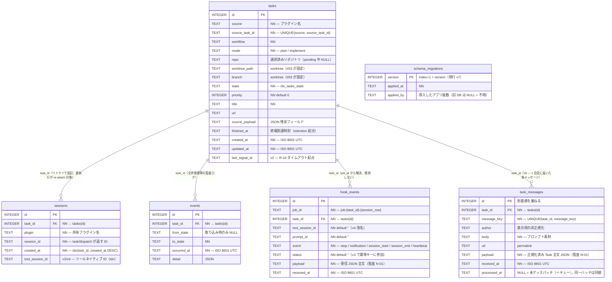

# 概要

タスク実行状態を SQLite（`$XDG_STATE_HOME/totsuka/state.db`、WAL・`foreign_keys=ON`）へ永続化し、アプリ再起動後に実行中タスクを復元する（F-70）。埋め込みマイグレーションを起動時に自動適用し、適用前に DB ファイルをバックアップ（`{path}.v{適用前バージョン}.bak`）する（§10.3）。

# Schema

## ER 図（v7 時点）

`tasks` を中心に `sessions` / `events` / `hook_events` / `task_messages` が `task_id` で 1:N にぶら下がる。**worktree に専用テーブルはなく**、タスクと 1:1 のため `tasks.repo` / `worktree_path` / `branch` の 3 列で表現する（実体の状態は git を直接参照）。tmux の pane も永続化せず、`session list` / `doctor` は tmux を実走査して DB と突き合わせる。`schema_migrations` は FK を持たない独立テーブル。

## tasks（F-70/F-73）

`UNIQUE(source, source_task_id)` で二重取り込みを防止（F-73、`upsert_task` が冪等）。`state` は TEXT（デバッグ容易性優先、`idx_tasks_state` で `status` 高速化）。ラベル/assignee 等の残余フィールドは `source_payload` に JSON で保持（個別カラム化しない）。`finished_at` は終端状態到達時刻で worktree 掃除 retention の起点（#53）。

| 列 | 型 | 備考 |
|---|---|---|
| id | INTEGER PK | rowid |
| source | TEXT | プラグイン名（"github" 等） |
| source_task_id | TEXT | Issue番号 / NotionページID |
| workflow | TEXT | マッチしたワークフロー名 |
| mode | TEXT | plan / implement |
| repo | TEXT NULL | 選択済みリポジトリ名（pending 中 NULL） |
| worktree_path / branch | TEXT NULL | #53 が設定 |
| state | TEXT | ステートマシンの状態名 |
| priority | INTEGER | 既定 0 |
| title / url | TEXT | 表示用 |
| source_payload | TEXT NULL | JSON 残余フィールド |
| finished_at | TEXT NULL | 終端到達時刻（retention 起点） |
| created_at / updated_at | TEXT | ISO 8601 (UTC) |
| last_signal_at | TEXT NULL | 最終フックシグナル時刻（v2/#134、R-10 タイムアウト起点）。`touch_last_signal` が更新 |

## sessions（F-37、#57）

`task/dispatch` が返す `session_id` をタスク・所有プラグインに紐付けて永続化する（再起動後の `session/attach` 再接続に使う）。1 タスクに複数行を許し（リトライは新セッションを追記）、`(task_id, created_at DESC)` インデックスの最新行が re-attach 対象。ストア API は `StateDb::record_session`（追記）/ `latest_session`（最新1件）/ `list_sessions`（履歴・新しい順）。

| 列 | 型 | 備考 |
|---|---|---|
| id | INTEGER PK | rowid |
| task_id | INTEGER FK→tasks(id) | 所有タスク |
| plugin | TEXT | 所有プラグイン名（"herdr" 等） |
| session_id | TEXT | エージェントの会話/セッションID |
| created_at | TEXT | ISO 8601 (UTC)。最新行が attach 対象 |
| tool_session_id | TEXT NULL | ツール（Claude Code 等）ネイティブの `session_id`（v2/#134、E-09。`--resume` 相関）。フックの SessionStart 観測時に `set_tool_session_id` が記録。`idx_sessions_tool_session`。v4/#196 で `claude_session_id` から改名 |

追加ストア API（v2/#134）: `set_tool_session_id(session_row_id, sid)`（当該セッション行へツールネイティブのセッション ID を記録）/ `find_session_by_tool_session_id(sid)`（ツールセッション ID から最新セッション行を逆引き）。フック dispatch 配線（#138）: `reserve_session(task_id, plugin)` が `session_id` 空でセッション行を先行確保し、その行 id を `job_id = job-{task_id}-{session_row}` の `session_row` に用いる（フックが echo する job_id は起動時に env 注入するため、`task/dispatch` 応答前に行 id が必要）。`task/dispatch` 応答後 `set_session_native_id(session_row_id, session_id)` で実 session_id を埋める。dispatch 失敗時は `delete_session(session_row_id)` で予約行をロールバック（空 id 行を残さず retry/recovery が誤 reattach しない）。

## hook_events（#131/#134、D-05/N-01/E-09）

Claude Code フック（Stop / Notification / SessionStart / SessionEnd / heartbeat）を UDS 経由で受信し**冪等に永続化**する監査ログ（N-01）。冪等キー `(job_id, tool_session_id, prompt_id, event, status)` の `UNIQUE` 制約で、多重発火・スプール再送・curl 再送の重複到着（**同一 status**）を無害化する（D-05/E-05/E-06）。**UNIQUE 構成列は NULL でなく空文字既定**（`tool_session_id` / `prompt_id` / `status` は `NOT NULL DEFAULT ''`）— SQLite は UNIQUE で NULL 同士を区別するため、NULL 既定だと重複排除が効かない。**`status` を冪等キーに含める理由（v3/#131 実機検収）**: Stop フックの `block` 差し戻しはエージェントを**同一ターン内で再完了**させるため、再完了 Stop は初回の空 Stop と `(job_id, session, prompt_id, event='stop')` を共有しつつ **status が変わる（UNKNOWN → COMPLETED）**。status を鍵に含めないと再完了が「再送」として dedup で捨てられ、完了が届かずタスクが `dispatched` で滞留する。status を含めることで status 変化は通し、同一 status の再送は従来どおり弾く（受け入れ #4 の二重遷移防止を維持）。書き込み経路（Engine 統合）は #138。

| 列 | 型 | 備考 |
|---|---|---|
| id | INTEGER PK | rowid |
| job_id | TEXT | 相関キー `"job-{task_id}-{session_row}"`（E-09。session_id 単独推測は禁止） |
| task_id | INTEGER FK→tasks(id) | 所有タスク |
| tool_session_id | TEXT NOT NULL DEFAULT '' | ツールネイティブの `session_id`（無ければ ''。v4/#196 で `claude_session_id` から改名） |
| prompt_id | TEXT NOT NULL DEFAULT '' | フック入力の `prompt_id`（無ければ ''） |
| event | TEXT | `stop` / `notification` / `session_start` / `session_end` / `heartbeat` |
| status | TEXT NOT NULL DEFAULT '' | `stop` の自己申告 `COMPLETED`/`NEEDS_INPUT`/`FAILED`/`UNKNOWN`、それ以外は `''`（v3 で冪等キーに参加。#131） |
| payload | TEXT | 受信 JSON 全文（監査 N-01） |
| received_at | TEXT | ISO 8601 (UTC) |

`idx_hook_events_task (task_id, id)`。追加ストア API:

- `record_hook_event(&HookEventInsert) -> HookEventOutcome` — `INSERT ... ON CONFLICT DO NOTHING`。新規は `New`、冪等キー衝突は `Duplicate`（呼び出し側は黙って捨てる）。
- `unknown_stop_streak(task_id) -> u32` — stop イベントを id 降順に走査し、最初の非 UNKNOWN stop までの UNKNOWN 連続数（D-02 のエスカレーション計数。**フック自己申告の block_count は信用せず DB から再計算**）。`idx_hook_events_task` + 早期 break で実質 O(streak)。

## task_messages（v5、#242/#257）

1 タスク = 1 **会話**であることの帰結として、1 タスクは複数のメッセージを受け取りうる。各行が 1 配送で、`processed_at IS NULL` の集合が「まだエージェントに渡していないメッセージ」= キューになる。

| カラム | 型 | 意味 |
|---|---|---|
| id | INTEGER PK | 会話内の到着順を兼ねる |
| task_id | INTEGER NOT NULL | → `tasks(id)` |
| message_key | TEXT NOT NULL | この配送の同一性（Slack `{channel}:{ts}` / GitHub コメント id）。`Task.message_key`、未設定のソースは `Task.id` にフォールバック |
| author | TEXT | 表示用の非正規化 |
| body | TEXT NOT NULL | プロンプト素材 |
| url | TEXT | permalink |
| payload | TEXT NOT NULL | 正規化済み `Task` 全文 JSON（監査 N-01） |
| received_at | TEXT NOT NULL | ISO 8601 (UTC) |
| processed_at | TEXT NULL | ディスパッチ時刻。NULL = 未処理。**同時にディスパッチした集合は同一値**を持つ |

`UNIQUE (task_id, message_key)` + `idx_task_messages_pending (task_id, processed_at)`。`hook_events`(v2/v3) と同形なのは、**at-least-once 配送の冪等化**という問題の形が同一だから。`payload` に全文を持ちつつ `author`/`body`/`url` を非正規化しているのは、読み出しで JSON を開かないため（このスキーマに `json_extract` は 1 件も無く、ここで第 1 号を作らない）。

**UNIQUE キーの選定**（SQLite は制約を in-place 変更できず、v3 は `hook_events` の再構築を要した。最初から狭く決める）:

- `revision`（編集時刻）は**含めない**。含めると誤字修正が高価な再実行と二重返信を招く。含めない失敗は「編集しても何も起きない」で害が小さい。後から広げるには再構築が要るが、狭めることはできない
- `kind` は**置かない**。会話への追加に相当するのはどのソースでもコメント（Slack 返信 / GitHub issue コメント）で、label・status は workflow trigger の関心事。必要になれば `ALTER TABLE ADD COLUMN` で後付けできる（UNIQUE と違い容易）

ストア API:

- `append_task_message(&TaskMessageInsert) -> TaskMessageOutcome` — `INSERT ... ON CONFLICT DO NOTHING`。新規は `New`、`(task_id, message_key)` 衝突は `Duplicate`
- `append_task_message_reopening(&TaskMessageInsert, detail) -> (TaskMessageOutcome, Option<TaskState>)` — 追記と、会話が終端だった場合の `Reopen` を**同一トランザクション**で行う（#258）。分けると、追記後 reopen 前の失敗で「タスクは終端のまま・未処理メッセージが台帳にある」状態が固定され、**以降の再配送は `Duplicate` になって reopen を再試行する経路が無く、そのメッセージが恒久的に埋もれる**。クラッシュ限定ではなく `SQLITE_BUSY` 等の通常エラー経路でも起こる。`upsert_task` との間に同じ結合が要らないのは、そこで失敗しても「台帳が空のタスク」が残るだけで再配送が普通に追記できるため
- `pending_task_messages(task_id) -> Vec<TaskMessage>` — 未処理のみ `id` 昇順（到着順。`received_at` ではなく `id` 順なのはタイムスタンプ解像度に依存しないため）
- `mark_messages_processed(task_id) -> String` — 未処理行に**バッチ共通の時刻**を打ち、その時刻を返す。バッチ ID 列を持たずにバッチを識別できるのはこの共通値のおかげ
- `unprocess_last_batch(task_id) -> usize` — 最新バッチのみをキューへ戻す（`task retry` 用）。バッチの特定は **`processed_at` の最大値ではなく id 最大の処理済み行**から行う（RFC 3339 は小数秒が可変長で辞書順に並ばない: `…:00.5Z` < `…:00Z`。id は整数で到着順）
- `list_task_messages(task_id) -> Vec<TaskMessage>` — 全件（表示用）

## events（F-72）

全状態遷移を記録する監査ログ。`from_state`（取り込み時 NULL）→ `to_state`、`occurred_at`、`detail`（JSON）。実行ログ断片（F-38）は含めず JSONL ログ側（#49）に置く。

## schema_migrations（§10.3）

`version` / `applied_at` / `applied_by`。`MIGRATIONS` 配列（index+1 = version）を順に適用。追記のみ（既存バージョンは不変）で、未適用があれば適用前に DB ファイルを **`{path}.v{適用前バージョン}.bak`** へバックアップし、適用時のみ INFO ログ（`from` / `to` / `backup`）を残す。現行 v7（v1 = 初期スキーマ、v2 = #134 の `hook_events` テーブル・`tasks.thread_key`/`last_signal_at`・`sessions.claude_session_id`、v3 = #131 実機検収フォローアップで `hook_events` の `UNIQUE` キーに `status` を追加・`status` を `NOT NULL DEFAULT ''` 化。SQLite は制約を in-place 変更できないためテーブルを再構築（`RENAME`→新規 `CREATE`→`INSERT ... SELECT COALESCE(status,'')`→旧 `DROP`）。既存行は保全。v4 = #196 ツール抽象化の rename で `sessions.claude_session_id` / `hook_events.claude_session_id` を `tool_session_id` へ `RENAME COLUMN`。SQLite ≥3.25 の RENAME COLUMN はテーブル制約・インデックス内の列参照も書き換えるため `hook_events` の UNIQUE 冪等キーは再構築不要。`idx_sessions_claude_session` のみ名前のため `idx_sessions_tool_session` へ作り直し。v5 = #257（[ADR-0015](/decisions/adr-0015-conversation-task-identity.md)）で `task_messages` を新設（**純追加**。既存の読み書きを一切変えないため、エピック #242 の途中でアップグレードが止まっても壊れた状態にならない。`tasks.thread_key` の DROP は後続バージョンに分離してある）。v6 = #258 で v5 以前の全タスクに台帳 1 行をバックフィル。**v5 が純追加だったことの裏返しで既存タスクの台帳が空のままになり**、ingest が「新着メッセージか」を台帳から判定するようになると**既存の終端タスクが最初の再配送で reopen され再実行される**（返信ソースなら二重返信）。再配送は例外ではなく定常で、`plugin_sdk::poll_loop` は自前 dedup を持たず毎 tick 全件を再 submit し orchestrator の `duplicate` ack だけに依存している。`message_key = source_task_id` は `message_key` 未設定ソースの ingest 側フォールバックと一致するため、それらの再配送は v5 以前と同じく dedup される。バックフィル行はタスクの状態によらず処理済みとして入れる — 指示内容は既に `tasks.source_payload` にあり（現行 dispatch が読む経路）、**未処理のプロンプト素材として提示してはならない**ため。`body` を空にしているのも同じ理由で、復元するには SQL で `source_payload` を JSON 走査する必要がありこのスキーマは意図的に JSON 走査を持たない）。v7 = #264 で `tasks.thread_key` と `idx_tasks_thread_key` を DROP（#242 で `Task.id` 自体が会話を指すようになり、相関すべき「先行タスク」が存在しなくなったため役目を終えた列。ingest / dispatch の作業が入り切ってから独立したバージョンとして落とすことで、v5〜v6 の途中で resume を壊さない。死んだ列は「設定しても何も起きない」罠として残るため放置しない。`DROP COLUMN` は SQLite ≥3.35 が必要だが `rusqlite` の bundled ビルドは十分に新しく、本プロジェクトは常に同梱の SQLite としか話さない）。

`applied_by`（#275）は **その version を導入した totsuka のアプリ版数**（`CARGO_PKG_VERSION`。ワークスペース共通 version なので totsuka 本体の版数と一致する）。「この DB を上げたのはどの版か」を事後に追うための台帳であり、**互換判定の権威ではない**（権威はスキーマ版数）。nullable で、列を持たなかった旧バイナリが書いた行は NULL のまま = 「不明」。バックフィルはしない（その版が実際に適用したわけではないため）。

この ALTER は **`MIGRATIONS` に載せず `StateDb::init` のブートストラップ段階**（適用ループの前）で条件付きに行う。`schema_migrations` は `MIGRATIONS` の各エントリを**採番している側**のテーブルなので、ALTER を仮に version N として書くと N 未満の INSERT が ALTER より先に走り、それらの INSERT が書く列がまだ無い（例: v5 の DB を v8 まで一気に上げると `no such column: applied_by`）。台帳テーブル自身をその台帳のバージョン番号で管理すると順序が循環する。ブートストラップに置くことで、適用ループ内の INSERT は常に `applied_by` を書ける。

バックアップ名にスキーマ版数を入れる（`state.db.v5.bak`）のは、固定名 `.bak` だと **アップグレードのたびに上書きされ、2 世代分を一気に上げたとき中間地点に戻れない**ため。またディスク上の `.bak` がどのスキーマ版か外から分からない問題も解消する。旧命名 `state.db.bak` は削除せず残置する。

**適用するのは `totsuka run` だけ**（#275、[ADR-0017](/decisions/adr-0017-state-db-compatibility-policy.md)）。`StateDb::open` は従来どおり適用するが、**`run` 以外の全 CLI コマンド**（`status` / `task` / `focus` / `doctor` が通る `Cx::open_state_db`）は **`StateDb::open_no_migrate`** を使う。分岐の基準は `run.lock` であって読み書きではない — `task cancel` / `retry` / `verify` はここを通って行を書き換えるが、スキーマは触らない。これらは `run.lock` を取らないため、適用契機をそこに残すとバージョンアップ直後に `run` と `status` を同時に叩いたとき**単一ロック下でないスキーマ変更**が起きうる（`busy_timeout` はワークスペース全体で未設定）。非適用オープンはスキーマ・台帳への書き込みを一切行わず、SQLite の `CREATE` フラグも落としてあるので `state.db` が無いときに空 DB を作ることもない（最終接続クローズ時の WAL チェックポイントは、どの接続でも起きるコミット済みページの畳み込みなので別）。未適用のスキーマは `SchemaOutdated` で `totsuka run` を案内する。

**対応範囲より新しい DB は両入口で起動拒否する**（`SchemaTooNew`）。従来 `if (current as usize) < MIGRATIONS.len()` は `current > len` のとき単に false になり `init` が `Ok` を返していたため、**知らないスキーマのまま動き続けていた**（追記のみの差分ならエラーすら出ず静かに食い違う）。エラー文は対応範囲の 1 つ先（`supported + 1`）を導入したアプリ版数を `applied_by` から引いて名指す — それが「最低これに上げろ」の答えだから。列を持たない旧台帳では `applied_by_of` が `None` に倒れ、案内句が落ちるだけで `no such column` にはならない。**互換判定の権威はスキーマ版数**で、アプリ版数を権威にするとスキーマ不変のパッチリリース間でも弾いてしまう。なお**ガードのコードを持たない 0.1.4 以前へのダウングレードは救えない**（→ [アップグレードとロールバック](/releases/upgrade-and-rollback.md)）。

`schema_version() -> (i64, Option<String>)` はスキーマ版数と `applied_by` を返す読み取り API で、`doctor` の `state-db` 行が使う。

[会話継続](/glossary/conversation-continuity.md)（E-09）用のストア API `find_by_thread_key` と `tasks.thread_key` 列は **#242/#264 で撤去した**（v7）。「この 2 つのタスクは同じ会話だ」と言うための相関キーだったが、`Task.id` 自体が会話を指すようになり、追いメンションは**同じタスクの別メッセージ**になったため、相関すべき「先行タスク」がそもそも存在しない。resume 元は `latest_session(task_id)` で自明に決まる。

# ステートマシン（F-71）

`domain::state` の純関数 `transition(from, event) -> Result<to>`。状態: `Queued / Pending / Dispatched / Running / WaitingInput / Verifying / Escalated / Publishing / Done / Failed / Cancelled`（`Verifying`=human 検収待ち・`Escalated`=人間対応待ちは #133 追加、どちらも非終端）。主要遷移: `queued→dispatched→running→publishing→done`、`running⇄waiting_input`、`queued⇄pending`（F-14）、非終端→`failed`/`cancelled`、`failed`/`cancelled`→`queued`（retry, F-44）。検収・エスカレーション遷移（#131/#133）: `running`/`waiting_input`/`escalated` →(SelfReportComplete)→ `verifying`（human 検収のみ。llm/none は既存 BeginPublish で `publishing` 直行 — `waiting_input`/`escalated` からの BeginPublish も可）、`verifying` →(ApproveVerification)→ `publishing` / →(VerificationFailed)→ `running`、全非終端 →(Escalate)→ `escalated`、`escalated` からは次シグナルで `verifying`/`publishing`/`waiting_input`/`running` へ復帰。`running`/`publishing` の実体はワークフロー（#54）が決め、ステートマシンはモード非依存。

# 再起動回復（F-37 / §5.3、#57）

`recovery::recover(db, attacher)` が起動時に `dispatched`/`running`/`waiting_input`/`verifying`/`escalated`/`publishing`（`RECOVERABLE_STATES`）のタスクを列挙し、各タスクの最新セッションへ `ports::AgentSession`（具象 `adapters::PluginAgentSession`）で `session/attach` を試みる。

- attach 成功: エージェント状態（F-32）に合わせてステートマシンを前方同期し（`apply_event`、`detail` に `kind:"recovery"` を記録）、`state/subscribe` を再確立して再開。
- セッション消失 / attach エラー / セッション未記録 / エージェント failed: タスクを「継続確認待ち」として `RecoveryReport::needs_confirmation` に載せる。**自動では failed にしない**（§5.3）。次アクション（`task retry` / `task cancel`）を人間へ提示。
- **human-gated 安全化（#133）**: `verifying`/`escalated` のタスクはエージェント状態に関わらず常に「継続確認待ち」（検収・エスカレーション解消を再起動で自動スキップしない）。また `waiting_input` 中にエージェントが Done を報告していたケースも自動 Publishing せず「継続確認待ち」とする（human 検収待ち相当のタスクが再起動を跨ぐと検収をスキップして自動 publish される穴の封鎖）。

リトライ（F-44）は `recovery::retry_plan(task, latest_session)` が判定: worktree＋セッションが残れば既存を再利用して会話再開、無ければ新規 worktree＋dispatch（履歴にセッション追記）。スロット再取得は `recovery::active_slot_claims(db, report)` が **再開した**タスクのうち slot 計上状態（`waiting_input` を除く）の `(repo, plugin)` を集めて `SlotManager::rebuild`（#55）へ渡す（継続確認待ちのタスクはスロットを占有しない）。

# 多重起動防止（F-74）

`run.lock` に PID を記録。取得失敗時は記録 PID の生存を [`ProcessProbe`](/components/orchestrator-core.md) で確認し、死んでいれば stale lock を自動回収する（`adapters::run_lock`）。

# 関連

- [orchestrator-core](/components/orchestrator-core.md)
- [Spec §4.8 状態管理 / §10.3](/product/orchestrator-spec.ja.md)
